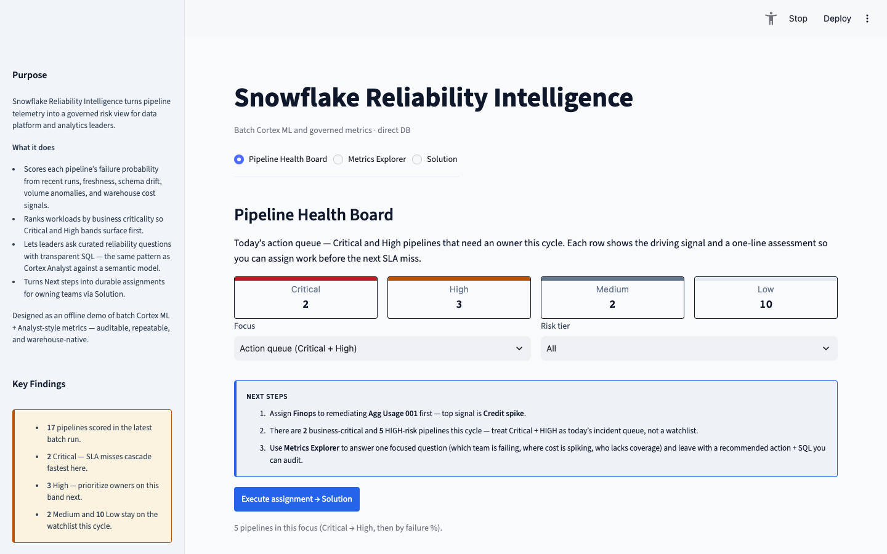
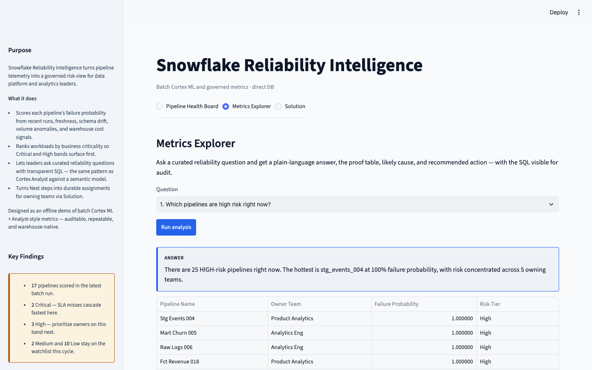
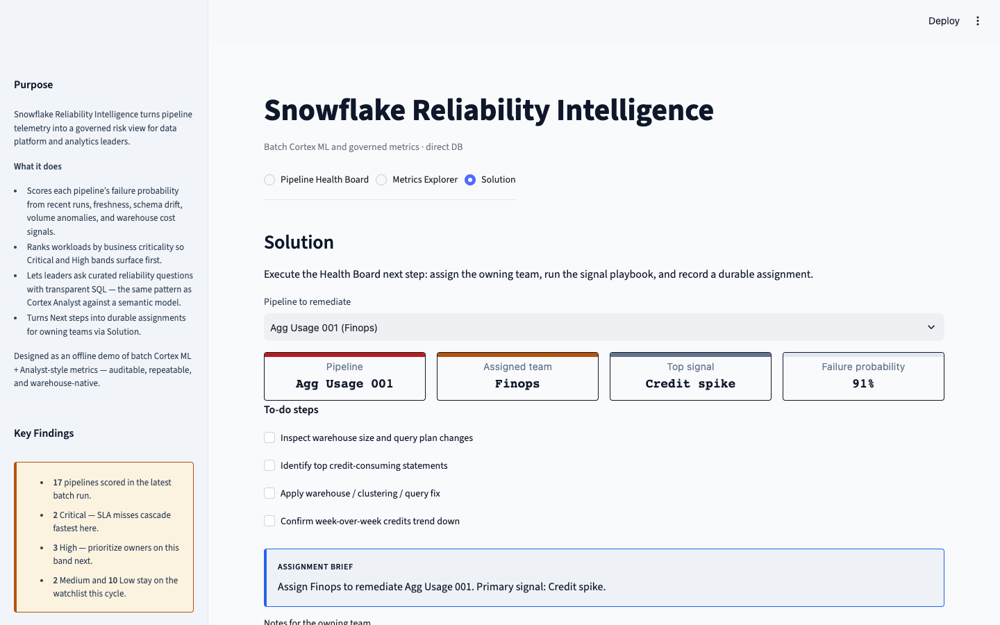

# Snowflake Reliability Intelligence

Batch **Snowflake Cortex ML + LLM** pipeline for data-platform reliability —
built as a Dynatrace-aligned portfolio project.

**Not a chatbot.** Ops dashboard with Critical/High action queue, signal playbooks,
and a 10-question Metrics Explorer (dropdown only).

> Portfolio flagship for **Snowflake Cortex** (batch ML → RCA narratives → Analyst).
> Companions: [InsightRAG](https://github.com/stephencox1026/insightrag) (RAG chat),
> [DocPulse](https://github.com/stephencox1026/docpulse) (doc MLOps),
> [TourMind](https://github.com/stephencox1026/tourmind) (LangGraph ops).

---

## Live demo

- **App:** _Add Streamlit Cloud URL after deploy_  
  - Repo: [`stephencox1026/snowflake-reliability`](https://github.com/stephencox1026/snowflake-reliability)  
  - Main file: `ui/cloud_app.py` (redeploy notes: [docs/SHIP.md](docs/SHIP.md))
- **Demo video (Loom):** _Add link after recording_ — script in [docs/DEMO.md](docs/DEMO.md)

### Screenshots

| Pipeline Health Board | Metrics Explorer |
|-----------------------|------------------|
|  |  |

| Solution |
|----------|
|  |

---

## What it demonstrates

| Capability | Offline demo | Snowflake production |
|---|---|---|
| ML classification | sklearn proxy | `SNOWFLAKE.ML.CLASSIFICATION` |
| RCA narratives | Template batch job | `AI_COMPLETE` SQL |
| Metrics Explorer | 10 SQL templates | Cortex Analyst + semantic YAML |
| Orchestration | `make demo` | Snowflake Tasks |
| Assignment playbooks | Solution tab → SQLite | Durable owner assignments |

Focused demo portfolio after `make demo`: **2 Critical · 3 High · 2 Medium · 10 Low**.
Holdout ML + Analyst metrics: see [docs/METRICS.md](docs/METRICS.md).

---

## Quick start (fast — no API / Snowflake needed)

Requires **Python 3.11** (`make install` creates `.venv` with `python3.11`).
Python 3.14 is not supported for local UI — Streamlit cold-starts take several minutes.

```bash
git clone https://github.com/stephencox1026/snowflake-reliability.git
cd snowflake-reliability
make install
make demo
make ui     # http://127.0.0.1:8504 — direct SQLite, fastest local path
```

Keep **one** Streamlit process warm. Concurrent cold imports against the same `.venv`
contend on disk. `make ui` warm-imports Streamlit once and disables the file watcher.

### Streamlit Cloud

1. Connect repo `stephencox1026/snowflake-reliability`
2. Main file: **`ui/cloud_app.py`**
3. Python **3.11** · uses `requirements.txt` + `packages.txt` (`libgomp1`)
4. First boot seeds the offline demo automatically — **no secrets required**

Optional API mode:

```bash
make api    # terminal 1 → http://127.0.0.1:8002/docs
make ui-api # terminal 2 — HTTP backend instead of direct DB
```

---

## Project structure

```
app/              FastAPI, ML, RCA, Analyst, synthetic data
ui/               Streamlit Health Board · Metrics Explorer · Solution
sql/              Snowflake DDL, Cortex ML, LLM, Tasks
semantic_models/  Cortex Analyst YAML
scripts/          build_demo, evaluate
docs/             Architecture, Cortex setup, Dynatrace alignment, ship kit
```

## Dynatrace tie-in

Complements [Dynatrace Snowflake Observability Agent](https://github.com/dynatrace-oss/dynatrace-snowflake-observability-agent) —
DSOA monitors infrastructure; this adds predictive ML and explainable narratives.

See [docs/DYNATRACE_ALIGNMENT.md](docs/DYNATRACE_ALIGNMENT.md).

## License

MIT — see [LICENSE](LICENSE).
